# LTI - Applicant Tracking System del Futuro

## Documento de Diseño de MVP v1.0

---

## 📋 Tabla de Contenidos

1. [Descripción del Producto](#1-descripción-del-producto)

   - 1.1 [Descripción Breve](#11-descripción-breve-del-software-lti)
   - 1.2 [Valor Añadido y Ventajas Competitivas](#12-valor-añadido-y-ventajas-competitivas)
   - 1.3 [Funciones Principales](#13-funciones-principales)
   - 1.4 [Lean Canvas](#14-lean-canvas)

2. [Casos de Uso Principales](#2-casos-de-uso-principales)

   - 2.1 [CU-01: Publicación Inteligente y Captación Multicanal](#21-cu-01-publicación-inteligente-y-captación-multicanal)
   - 2.2 [CU-02: Evaluación Colaborativa con IA](#22-cu-02-evaluación-colaborativa-con-ia)
   - 2.3 [CU-03: Orquestación Inteligente de Entrevistas](#23-cu-03-orquestación-inteligente-de-entrevistas)

3. [Modelo de Datos](#3-modelo-de-datos)

   - 3.1 [Entidades del Sistema](#31-entidades-del-sistema)
   - 3.2 [Diagrama Entidad-Relación](#32-diagrama-entidad-relación)

4. [Diseño del Sistema a Alto Nivel](#4-diseño-del-sistema-a-alto-nivel)

   - 4.1 [Descripción de la Arquitectura](#41-descripción-de-la-arquitectura)
   - 4.2 [Diagrama de Arquitectura](#42-diagrama-de-arquitectura)

5. [Diagrama C4 en Profundidad](#5-diagrama-c4-en-profundidad)
   - 5.1 [Nivel 1 - Contexto del Sistema](#51-nivel-1---contexto-del-sistema)
   - 5.2 [Nivel 2 - Contenedores](#52-nivel-2---contenedores)
   - 5.3 [Nivel 3 - Componentes](#53-nivel-3---componentes)
   - 5.4 [Nivel 4 - Código](#54-nivel-4---código)

---

## 1. Descripción del Producto

### 1.1 Descripción Breve del Software LTI

LTI (Leading Talent Intelligence) es un Applicant Tracking System de nueva generación diseñado para revolucionar la forma en que las empresas atraen, evalúan y contratan talento. Utilizando inteligencia artificial avanzada, colaboración en tiempo real y automatización inteligente, LTI transforma el proceso de reclutamiento en una experiencia fluida, eficiente y basada en datos para equipos de HR, hiring managers y candidatos.
Público Objetivo: Empresas de rápido crecimiento (50-5000 empleados), startups tecnológicas, scale-ups y empresas modernas que valoran la innovación en sus procesos de people operations.
Propuesta de Valor Única: LTI reduce el time-to-hire en un 40% mediante IA predictiva, elimina el 70% de las tareas administrativas con automatización inteligente, y mejora la calidad de las contrataciones con evaluaciones colaborativas en tiempo real y scoring basado en machine learning.

### 1.2 Valor Añadido y Ventajas Competitivas

1. **AI-Powered Candidate Scoring**
   Implementación: Motor de ML que analiza CVs, perfiles de LinkedIn, respuestas a cuestionarios y entrevistas en video asíncronas. Utiliza NLP para extraer skills, experiencia y fit cultural, generando un score predictivo de éxito (0-100) basado en datos históricos de contrataciones exitosas.
   Ventaja: Reduce el sesgo humano y prioriza automáticamente candidatos con mayor probabilidad de éxito, ahorrando 15+ horas semanales en screening manual.
2. **Colaboración en Tiempo Real con Live Board**
   Implementación: WebSocket-based collaborative workspace donde reclutadores, hiring managers y stakeholders ven actualizaciones instantáneas, pueden comentar candidatos, votar, y tomar decisiones sincronizadas. Incluye videollamadas integradas y anotaciones compartidas.
   Ventaja: Elimina cadenas interminables de emails y acelera la toma de decisiones. Los equipos distribuidos trabajan como si estuvieran en la misma sala.
3. **Smart Interview Orchestration**
   Implementación: Motor de scheduling que integra con Google Calendar, Outlook y Calendly. Usa algoritmos de optimización para encontrar slots óptimos considerando timezones, prioridades, disponibilidad de salas (físicas/virtuales) y preferencias. Incluye recordatorios automatizados y rescheduling inteligente.
   Ventaja: Reduce el tiempo de coordinación de entrevistas de días a minutos, eliminando el 85% de los emails de coordinación.
4. **Automated Workflow Engine**
   Implementación: Sistema de workflows visuales (estilo no-code) donde HR puede diseñar pipelines personalizados. Triggers automáticos basados en eventos (nuevo candidato, puntaje >80, feedback recibido) ejecutan acciones (enviar email, asignar evaluador, mover etapa, crear tarea).
   Ventaja: Cada empresa puede adaptar LTI a sus procesos únicos sin código, manteniendo consistencia y eliminando tareas repetitivas.
5. **Candidate Experience Portal**
   Implementación: Portal personalizado donde candidatos hacen tracking de su aplicación en tiempo real, reciben updates automáticos, completan tests online, suben documentos adicionales y se comunican bidireccionalmente con HR. Incluye chatbot con IA para responder FAQs.
   Ventaja: Mejora el employer branding y reduce hasta en 60% las consultas de candidatos a HR sobre el status de su aplicación.
6. **Predictive Analytics & Insights Dashboard**
   Implementación: Dashboard con métricas en tiempo real: time-to-hire por posición, conversion rates por etapa, efectividad de canales de sourcing, predicciones de cuando se llenará una posición, análisis de diversidad, y bottlenecks del proceso.
   Ventaja: Toma de decisiones basada en datos. Identificación proactiva de problemas en el pipeline y optimización continua del proceso.
7. **Multi-channel Job Distribution**
   Implementación: Integración nativa con 50+ job boards (LinkedIn, Indeed, Glassdoor, AngelList, etc.), redes sociales, y website de la empresa. Publicación simultánea con un clic, sincronización automática de aplicaciones, y tracking de ROI por canal.
   Ventaja: Maximiza el reach sin esfuerzo manual, identificando qué canales generan candidatos de mayor calidad para optimizar presupuesto.

### 1.3 Funciones Principales

| #   | Funcionalidad                  | Descripción                                                                                                                                     | Beneficio                                                                                                              | Prioridad MVP |
| --- | ------------------------------ | ----------------------------------------------------------------------------------------------------------------------------------------------- | ---------------------------------------------------------------------------------------------------------------------- | ------------- |
| 1   | Job Requisition Management     | Creación, aprobación y gestión de requisiciones de empleo con workflows customizables. Incluye templates, campos personalizados y multi-idioma. | Centraliza y estandariza la creación de posiciones, con trazabilidad completa del proceso de aprobación.               | Alta          |
| 2   | AI-Powered Candidate Screening | Motor de IA que parsea CVs, extrae información relevante, y genera scoring automático basado en match con requisitos del puesto.                | Ahorra 70% del tiempo en revisión inicial y elimina sesgos inconscientes en la primera criba.                          | Alta          |
| 3   | Collaborative Evaluation Board | Espacio colaborativo en tiempo real donde el equipo de hiring evalúa candidatos, deja feedback estructurado, y toma decisiones consensuadas.    | Acelera decisiones de hiring y mejora la calidad mediante evaluación multi-perspectiva.                                | Alta          |
| 4   | Smart Calendar Integration     | Sincronización bidireccional con calendarios empresariales para scheduling automático de entrevistas con optimización de slots.                 | Elimina fricción en coordinación de entrevistas, respetando preferencias y timezones.                                  | Alta          |
| 5   | Automated Communication Hub    | Sistema de notificaciones y emails automáticos personalizables por etapa, con templates y variables dinámicas.                                  | Mantiene a candidatos informados sin esfuerzo manual, mejorando candidate experience.                                  | Alta          |
| 6   | Interview Kit Generator        | Generación automática de guías de entrevista personalizadas por rol, con preguntas sugeridas por IA y scorecards estructurados.                 | Estandariza evaluaciones y mejora la calidad de las entrevistas mediante preparación estructurada.                     | Media         |
| 7   | Video Interview Platform       | Plataforma integrada para entrevistas en video (en vivo y asíncronas) con transcripción automática y análisis de sentimiento.                   | Flexibiliza el proceso, permite entrevistar candidatos remotos, y genera insights adicionales mediante análisis de IA. | Media         |
| 8   | Talent Pool Management         | Base de datos inteligente de candidatos pasados y futuros con segmentación, tagging automático, y reactivación basada en nuevas posiciones.     | Reduce costos de sourcing al reciclar candidatos de calidad que no encajaron en el pasado.                             | Media         |
| 9   | Offer Management System        | Generación, aprobación y envío de offer letters con firma electrónica integrada y tracking de status.                                           | Acelera el cierre de candidatos y digitaliza completamente el proceso de ofertas.                                      | Alta          |
| 10  | Compliance & Audit Trail       | Sistema completo de logging, cumplimiento con regulaciones (GDPR, EEOC), y reportes de auditoría automáticos.                                   | Protege legalmente a la empresa y facilita auditorías mediante trazabilidad completa.                                  | Media         |
| 11  | Mobile Application             | App nativa iOS/Android para reclutadores y hiring managers con funcionalidad core (revisar candidatos, aprobar, comentar, schedule).            | Permite movilidad y toma de decisiones desde cualquier lugar, acelerando el proceso.                                   | Baja          |
| 12  | Advanced Analytics & Reporting | Suite de reportes predefinidos y constructor custom de dashboards con métricas clave del proceso de reclutamiento.                              | Visibilidad completa de KPIs, identificación de bottlenecks, y optimización basada en datos.                           | Media         |

### 1.4 Lean Canvas


## 2. Casos de Uso Principales

### 2.1 CU-01: Publicación Inteligente y Captación Multicanal

#### Descripción Narrativa

**Contexto:** Un hiring manager de una startup tecnológica necesita contratar urgentemente un Senior Software Engineer. El departamento de HR debe publicar la oferta rápidamente y maximizar el alcance para atraer candidatos de calidad.
**Actores:**

- Hiring Manager (Solicitante): Manager de ingeniería que necesita cubrir la posición
- Recruiter/HR Specialist (Principal): Responsable de crear y publicar la oferta
- HR Director (Aprobador): Responsable de aprobar requisiciones según budget
- Sistema LTI (Sistema): Plataforma ATS
- Job Boards externos (Sistemas externos): LinkedIn, Indeed, Glassdoor, etc.
- Candidatos potenciales (Secundarios): Personas que verán y aplicarán a la oferta

**Objetivo:** Crear, aprobar y publicar una oferta de empleo en múltiples canales de forma eficiente, con optimización de contenido mediante IA, maximizando el alcance y la calidad de candidatos atraídos.

1. **Hiring Manager crea requisición:** El hiring manager accede a LTI y crea una nueva job requisition, completando información básica (título, departamento, seniority, headcount aprobado, justificación de negocio).
2. **IA genera job description:** El sistema utiliza templates inteligentes y, basándose en descripciones exitosas similares, genera automáticamente una job description atractiva con responsabilidades, requisitos, nice-to-have skills y benefits. El hiring manager puede editar y personalizar.
3. **IA optimiza para SEO y engagement:** El motor de IA analiza el contenido y sugiere mejoras para aumentar visibilidad en job boards y atractivo para candidatos (keywords, lenguaje inclusivo, estructura, call-to-action).
4. **Workflow de aprobación:** El sistema envía automáticamente la requisición al HR Director para aprobación. Notificación en tiempo real vía email y dentro de la plataforma.
5. **HR Director aprueba:** El director revisa la requisición, valida contra budget y headcount aprobado, y aprueba la posición. Si requiere cambios, los comenta y devuelve al hiring manager.
6. **Recruiter configura distribución:** Una vez aprobada, el recruiter selecciona los canales de publicación (LinkedIn, Indeed, Glassdoor, website corporativo, etc.), configura parámetros (presupuesto por canal si aplica, duración, targeting), y personaliza el mensaje para cada plataforma.
7. **Publicación multicanal sincronizada:** Con un clic, LTI publica simultáneamente en todos los canales seleccionados, adaptando el formato a cada plataforma mediante APIs nativas.
8. **Tracking y sincronización automática:** Las aplicaciones recibidas en cualquier canal se sincronizan automáticamente en LTI. El sistema trackea qué canal genera cada aplicación y calcula métricas de efectividad (candidatos por canal, quality score por fuente).
9. **Optimización continua:** El dashboard analytics muestra en tiempo real el performance de cada canal. El recruiter puede pausar canales de bajo rendimiento y aumentar inversión en los más efectivos.
10. **Notificaciones proactivas:** El sistema notifica al recruiter cuando se reciben aplicaciones de alta calidad (score >85) para revisión prioritaria.

**Resultado Esperado:** La oferta está publicada en 6+ canales en menos de 30 minutos desde su creación, con contenido optimizado que atrae candidatos de calidad. El tiempo de captación se reduce de días a minutos.

- Job requisition activa en el sistema con status "Published"
- Oferta visible en todos los canales configurados
- Sistema preparado para recibir y sincronizar aplicaciones
- Analytics dashboard configurado para tracking de esta posición

#### Diagrama UML de Caso de Uso (CU-01)

```mermaid
graph LR
HM[Hiring Manager]
REC[Recruiter]
HRD[HR Director]
CAN[Candidatos]

    subgraph "Sistema LTI"
        UC1[Crear Job Requisition]
        UC2[Generar Job Description con IA]
        UC3[Optimizar contenido SEO]
        UC4[Aprobar Requisición]
        UC5[Configurar Distribución Multicanal]
        UC6[Publicar en Job Boards]
        UC7[Sincronizar Aplicaciones]
        UC8[Trackear Performance por Canal]
        UC9[Aplicar a Oferta]
    end

    JB[Job Boards Externos<br/>LinkedIn, Indeed, etc.]

    HM -->|crea| UC1
    UC1 -->|include| UC2
    UC2 -->|include| UC3
    UC1 -->|triggers| UC4
    HRD -->|ejecuta| UC4
    UC4 -->|aprueba| UC5
    REC -->|configura| UC5
    UC5 -->|include| UC6
    UC6 -->|publica en| JB
    JB -->|aplicaciones desde| UC7
    UC7 -->|include| UC8
    REC -->|monitorea| UC8
    CAN -->|ejecuta| UC9
    UC9 -->|datos a| UC7
```



### 2.2 CU-02: Evaluación Colaborativa con IA

#### Descripción Narrativa (CU-02)

**Contexto:** Después de publicar una oferta de Senior Product Manager, el equipo de HR ha recibido 150 aplicaciones. El recruiter, el hiring manager, y dos stakeholders clave (VP Product y Head of Design) necesitan colaborar para identificar y evaluar a los mejores candidatos de forma eficiente.

**Actores:**

- Recruiter (Coordinador): Gestiona el proceso y facilita la colaboración
- Hiring Manager - VP Product (Evaluador Principal): Toma la decisión final de contratación
- Stakeholders (Evaluadores Secundarios): Head of Design, otro PM Senior
- Sistema de IA de LTI (Automatizado): Realiza screening y scoring
- Candidatos (Pasivos): Son evaluados durante el proceso

**Objetivo:**

Filtrar eficientemente 150 candidatos a un shortlist de 5-8 finalistas mediante evaluación colaborativa asistida por IA, asegurando que todos los stakeholders participen y la decisión sea consensuada y basada en datos.

**Flujo Principal:**

1. **IA realiza screening inicial:** El sistema automáticamente parsea los 150 CVs recibidos, extrae información estructurada (skills, experiencia, educación, keywords), y genera un AI Score (0-100) basado en match con requisitos del job. Los candidatos se organizan automáticamente por score descendente.
2. **Recruiter revisa top candidates:** El recruiter accede al Candidate Board y revisa los candidatos con score >75 (aproximadamente 30 candidatos). Descarta rápidamente aquellos con flags obvios (salary expectations fuera de rango, relocación no posible, etc.).
3. **Recruiter crea evaluation workspace:** Para los 20 candidatos preseleccionados, el recruiter crea un Collaborative Evaluation Board e invita al VP Product, Head of Design y PM Senior. Cada uno recibe notificación en tiempo real.
4. **Evaluación asíncrona individual:** Cada stakeholder entra al board cuando le convenga y revisa los candidatos asignados. Pueden ver el CV completo, el AI Score con justificación, LinkedIn profile integrado, y pueden dejar ratings (1-5 stars) y comentarios estructurados en categorías (Technical Skills, Product Sense, Communication, Culture Fit).
5. **IA genera insights adicionales:** Para cada candidato, la IA genera un briefing automático destacando: fortalezas clave, posibles red flags, preguntas sugeridas para entrevista, y comparación con el profile ideal.
6. **Sincronización en tiempo real:** A medida que los stakeholders dejan feedback, todos ven las actualizaciones instantáneamente. El sistema calcula un Consensus Score combinando AI Score + ratings humanos ponderados.
7. **Sesión de calibración en vivo:** El recruiter programa una reunión de 30 minutos donde el equipo se conecta con el Evaluation Board abierto en pantalla compartida. Discuten candidatos con scoring divergente y resuelven desacuerdos en tiempo real, ajustando ratings.
8. **Shortlisting colaborativo:** El equipo selecciona de forma consensuada 8 candidatos finalistas para avanzar a entrevistas. El sistema permite "votar" y marca a los seleccionados. Los candidatos descartados reciben automáticamente un email de rechazo personalizado.
9. **Generación automática de interview kits:** Para cada finalista, LTI genera automáticamente un Interview Kit personalizado con: resumen del candidato, fortalezas a validar, áreas de concern a explorar, y preguntas sugeridas por IA específicas para su perfil.
10. **Asignación de entrevistadores:** El recruiter asigna qué stakeholders entrevistarán a cada candidato y en qué orden, configurando el workflow de entrevistas.

**Resultado Esperado:**

De 150 candidatos a 8 finalistas en 2-3 días (vs 1-2 semanas en proceso tradicional). Todos los stakeholders participan eficientemente, el proceso es transparente y basado en datos, y las decisiones son consensuadas.

**Postcondiciones:**

- 8 candidatos con status "Shortlisted" listos para entrevistas
- 142 candidatos con status "Rejected" con comunicación automática enviada
- Interview Kits generados y disponibles para entrevistadores
- Audit trail completo de todas las evaluaciones y decisiones

#### Diagrama UML de Caso de Uso (CU-02)


### 2.3 CU-03: Orquestación Inteligente de Entrevistas

#### Descripción Narrativa (CU-03)

**Contexto:** El equipo ha shortlisted 8 candidatos para Senior Product Manager. Cada candidato debe pasar por 4 entrevistas: (1) Phone screen con Recruiter, (2) Product Case con PM Senior, (3) Behavioral con VP Product, (4) Culture Fit con Head of Design. Coordinar 32 entrevistas (8 candidatos x 4 entrevistas) considerando disponibilidades, timezones, y preferencias es extremadamente complejo manualmente.

**Actores:**

- Recruiter (Orquestador): Coordina todo el proceso de entrevistas
- Candidatos (8 finalistas): Deben ser entrevistados
- Entrevistadores (4 diferentes roles): Tienen calendarios ocupados y limitaciones
- Sistema de Scheduling de LTI (Automatizado): Motor inteligente de optimización
- Sistemas de Calendario (Externos): Google Calendar, Outlook
- Sistema de Videoconferencia (Externo): Zoom, Google Meet

**Objetivo:**

Coordinar automáticamente 32 entrevistas optimizando para mínimo time-to-complete, respetando restricciones de disponibilidad, timezones, y preferencias, sin intervención manual del recruiter más allá de la configuración inicial.

**Flujo Principal:**

1. **Recruiter configura proceso de entrevistas:** El recruiter define el interview pipeline para la posición: 4 etapas secuenciales, qué entrevistador en cada etapa, duración de cada entrevista (30min phone screen, 60min case, 45min behavioral, 30min culture), y rules (no más de 2 entrevistas por día, mínimo 2 horas de buffer entre entrevistas, preferencia por mañanas).
2. **Integración de calendarios:** LTI sincroniza en tiempo real los calendarios de Google/Outlook de todos los entrevistadores. Identifica automáticamente bloques de disponibilidad considerando eventos existentes, working hours, y timezones.
3. **Candidatos indican disponibilidad:** El sistema envía automáticamente a los 8 candidatos un link a una página donde pueden indicar su disponibilidad general para las próximas 2 semanas mediante un selector visual de slots. Pueden indicar timezone y preferencias.
4. **Motor de optimización calcula solución:** El algoritmo de LTI procesa todas las restricciones (disponibilidad de 12 personas, timezones, rules del proceso, secuencialidad) y calcula la combinación óptima de slots que minimiza el tiempo total para completar todas las entrevistas.
5. **Recruiter revisa propuesta automática:** El sistema presenta una vista de Gantt con las 32 entrevistas propuestas. El recruiter puede ver visualmente el timeline completo, identificar conflictos potenciales, y hacer ajustes manuales si es necesario (drag & drop de entrevistas).
6. **Confirmación automática:** Con un clic, el recruiter confirma el schedule. El sistema automáticamente: (a) Crea eventos en los calendarios de todos los participantes, (b) Genera meeting links de Zoom/Meet, (c) Envía invitaciones de calendario con toda la información, (d) Envía emails de confirmación a candidatos con detalles.
7. **Recordatorios inteligentes:** El sistema envía recordatorios automáticos: 24h antes (email + push notification), 1h antes (notification), y 15min antes (notification con link directo al meeting). Los entrevistadores reciben el Interview Kit en el recordatorio de 24h.
8. **Rescheduling automático:** Si un participante cancela o solicita cambio, el sistema detecta el conflicto y automáticamente: (a) Notifica a todos los afectados, (b) Propone 3 slots alternativos óptimos, (c) Una vez seleccionado, actualiza calendarios y envía nuevas invitaciones.
9. **Feedback post-entrevista:** Inmediatamente después de cada entrevista, el entrevistador recibe un link para dejar feedback estructurado. El sistema trackea quién ha dejado feedback y envía gentle reminders a los que están pendientes.
10. **Tracking en tiempo real:** El recruiter tiene un dashboard donde ve el status de las 32 entrevistas en tiempo real: completadas, pendientes, canceladas, feedback recibido. Puede identificar bottlenecks (ej: un entrevistador que no deja feedback) y actuar.
11. **Auto-progresión de candidatos:** Una vez completadas las 4 entrevistas de un candidato y recibido todo el feedback, el sistema automáticamente progresa al candidato a la siguiente fase (Decision / Offer) y notifica al recruiter.

**Resultado Esperado:**

Las 32 entrevistas están completamente coordinadas en menos de 15 minutos de trabajo del recruiter (vs 8-10 horas manualmente). El time-to-complete se optimiza (todas las entrevistas completadas en 10-12 días vs 3-4 semanas tradicionalmente). Zero emails de coordinación manual.

**Postcondiciones:**

- 32 entrevistas agendadas con eventos en calendarios de todos los participantes
- Candidatos y entrevistadores notificados con toda la información necesaria
- Sistema configurado para enviar recordatorios automáticos
- Dashboard de tracking activo para monitoring en tiempo real
- Interview Kits distribuidos a entrevistadores

#### Diagrama UML de Caso de Uso (CU-03)


## 3. Modelo de Datos

### 3.1 Entidades del Sistema

#### 1. Organization (Empresa)

**Propósito:** Representa a la empresa cliente que usa LTI. En un modelo multi-tenant, cada organización tiene sus propios datos aislados.

**Atributos:**

| Atributo            | Tipo         | Constraint      | Descripción                              |
| ------------------- | ------------ | --------------- | ---------------------------------------- |
| organization_id     | UUID         | PRIMARY KEY     | Identificador único de la organización   |
| organization_name   | VARCHAR(200) | NOT NULL        | Nombre legal de la empresa               |
| domain              | VARCHAR(100) | UNIQUE NOT NULL | Dominio corporativo (ej: acme.com)       |
| industry            | VARCHAR(100) |                 | Industria/sector de la empresa           |
| company_size        | VARCHAR(50)  |                 | Rango de empleados (1-50, 51-200, etc.)  |
| logo_url            | VARCHAR(500) |                 | URL del logo corporativo                 |
| subscription_tier   | VARCHAR(50)  | NOT NULL        | Plan contratado (Starter/Pro/Enterprise) |
| subscription_status | VARCHAR(50)  | NOT NULL        | Estado (Active/Suspended/Cancelled)      |
| billing_email       | VARCHAR(255) |                 | Email de facturación                     |
| created_at          | TIMESTAMP    | NOT NULL        | Fecha de creación                        |
| updated_at          | TIMESTAMP    | NOT NULL        | Última actualización                     |

#### 2. User (Usuario del Sistema)

**Propósito:** Usuarios que operan el sistema LTI (reclutadores, hiring managers, admins).

**Atributos:**

| Atributo        | Tipo         | Constraint                 | Descripción                                            |
| --------------- | ------------ | -------------------------- | ------------------------------------------------------ |
| user_id         | UUID         | PRIMARY KEY                | Identificador único del usuario                        |
| organization_id | UUID         | FOREIGN KEY → Organization | Organización a la que pertenece                        |
| email           | VARCHAR(255) | UNIQUE NOT NULL            | Email corporativo                                      |
| password_hash   | VARCHAR(255) | NOT NULL                   | Password hasheado (bcrypt)                             |
| first_name      | VARCHAR(100) | NOT NULL                   | Nombre                                                 |
| last_name       | VARCHAR(100) | NOT NULL                   | Apellido                                               |
| role            | VARCHAR(50)  | NOT NULL                   | Rol (Admin/Recruiter/HiringManager/Interviewer/Viewer) |
| department_id   | UUID         | FOREIGN KEY → Department   | Departamento (nullable)                                |
| avatar_url      | VARCHAR(500) |                            | URL del avatar del usuario                             |
| timezone        | VARCHAR(100) |                            | Timezone del usuario (ej: America/New_York)            |
| locale          | VARCHAR(10)  |                            | Idioma preferido (en/es/fr)                            |
| is_active       | BOOLEAN      | NOT NULL DEFAULT TRUE      | Si el usuario está activo                              |
| last_login_at   | TIMESTAMP    |                            | Último login                                           |
| created_at      | TIMESTAMP    | NOT NULL                   | Fecha de creación                                      |
| updated_at      | TIMESTAMP    | NOT NULL                   | Última actualización                                   |

#### 3. Department (Departamento)

**Propósito:** Departamentos dentro de la organización que solicitan contrataciones.

**Atributos:**

| Atributo        | Tipo         | Constraint                 | Descripción                                        |
| --------------- | ------------ | -------------------------- | -------------------------------------------------- |
| department_id   | UUID         | PRIMARY KEY                | Identificador único                                |
| organization_id | UUID         | FOREIGN KEY → Organization | Organización                                       |
| department_name | VARCHAR(100) | NOT NULL                   | Nombre del departamento (Engineering, Sales, etc.) |
| head_user_id    | UUID         | FOREIGN KEY → User         | Responsable del departamento (nullable)            |
| cost_center     | VARCHAR(50)  |                            | Centro de costos para contabilidad                 |
| created_at      | TIMESTAMP    | NOT NULL                   | Fecha de creación                                  |
| updated_at      | TIMESTAMP    | NOT NULL                   | Última actualización                               |

#### 4. JobRequisition (Requisición de Empleo)

**Propósito:** Solicitud formal para abrir una nueva posición. Es el origen del proceso de hiring.

**Atributos:**

| Atributo            | Tipo          | Constraint                 | Descripción                                                       |
| ------------------- | ------------- | -------------------------- | ----------------------------------------------------------------- |
| job_requisition_id  | UUID          | PRIMARY KEY                | Identificador único                                               |
| organization_id     | UUID          | FOREIGN KEY → Organization | Organización                                                      |
| created_by_user_id  | UUID          | FOREIGN KEY → User         | Usuario que creó la requisición                                   |
| department_id       | UUID          | FOREIGN KEY → Department   | Departamento solicitante                                          |
| job_title           | VARCHAR(200)  | NOT NULL                   | Título de la posición                                             |
| employment_type     | VARCHAR(50)   | NOT NULL                   | Tipo (FullTime/PartTime/Contract/Intern)                          |
| seniority_level     | VARCHAR(50)   |                            | Nivel (Junior/Mid/Senior/Lead/Principal)                          |
| headcount           | INTEGER       | NOT NULL DEFAULT 1         | Número de personas a contratar                                    |
| justification       | TEXT          |                            | Justificación de negocio para la posición                         |
| salary_range_min    | DECIMAL(12,2) |                            | Rango salarial mínimo                                             |
| salary_range_max    | DECIMAL(12,2) |                            | Rango salarial máximo                                             |
| salary_currency     | VARCHAR(3)    |                            | Moneda (USD/EUR/GBP)                                              |
| location            | VARCHAR(200)  |                            | Ubicación (oficina o Remote)                                      |
| remote_policy       | VARCHAR(50)   |                            | Política remoto (Onsite/Hybrid/Remote)                            |
| status              | VARCHAR(50)   | NOT NULL                   | Estado (Draft/PendingApproval/Approved/Rejected/Published/Closed) |
| approved_by_user_id | UUID          | FOREIGN KEY → User         | Quien aprobó (nullable)                                           |
| approved_at         | TIMESTAMP     |                            | Fecha de aprobación                                               |
| created_at          | TIMESTAMP     | NOT NULL                   | Fecha de creación                                                 |
| updated_at          | TIMESTAMP     | NOT NULL                   | Última actualización                                              |

#### 5. JobPosting (Oferta Publicada)

**Propósito:** Versión publicada de una requisición con descripción completa y configuración de distribución.

**Atributos:**

| Atributo             | Tipo      | Constraint                   | Descripción                                       |
| -------------------- | --------- | ---------------------------- | ------------------------------------------------- |
| job_posting_id       | UUID      | PRIMARY KEY                  | Identificador único                               |
| job_requisition_id   | UUID      | FOREIGN KEY → JobRequisition | Requisición origen                                |
| organization_id      | UUID      | FOREIGN KEY → Organization   | Organización                                      |
| job_description      | TEXT      | NOT NULL                     | Descripción completa del puesto (generada por IA) |
| responsibilities     | TEXT      |                              | Responsabilidades detalladas                      |
| requirements         | TEXT      |                              | Requisitos técnicos y experiencia                 |
| nice_to_have         | TEXT      |                              | Skills deseables pero no requeridas               |
| benefits             | TEXT      |                              | Beneficios y perks de la posición                 |
| application_deadline | DATE      |                              | Fecha límite para aplicar (nullable)              |
| is_active            | BOOLEAN   | NOT NULL DEFAULT TRUE        | Si está activamente publicada                     |
| views_count          | INTEGER   | DEFAULT 0                    | Número de veces vista                             |
| applications_count   | INTEGER   | DEFAULT 0                    | Número de aplicaciones recibidas                  |
| published_at         | TIMESTAMP |                              | Fecha de publicación                              |
| closed_at            | TIMESTAMP |                              | Fecha de cierre                                   |
| created_at           | TIMESTAMP | NOT NULL                     | Fecha de creación                                 |
| updated_at           | TIMESTAMP | NOT NULL                     | Última actualización                              |

#### 6. JobPostingChannel (Canal de Distribución)

**Propósito:** Configuración de dónde y cómo se publica cada oferta (LinkedIn, Indeed, etc.).

**Atributos:**

| Atributo            | Tipo          | Constraint               | Descripción                                                  |
| ------------------- | ------------- | ------------------------ | ------------------------------------------------------------ |
| channel_id          | UUID          | PRIMARY KEY              | Identificador único                                          |
| job_posting_id      | UUID          | FOREIGN KEY → JobPosting | Oferta asociada                                              |
| channel_type        | VARCHAR(50)   | NOT NULL                 | Tipo de canal (LinkedIn/Indeed/Glassdoor/CompanyWebsite/etc) |
| channel_specific_id | VARCHAR(200)  |                          | ID del posting en el canal externo                           |
| status              | VARCHAR(50)   | NOT NULL                 | Estado (Publishing/Active/Paused/Closed/Failed)              |
| budget_allocated    | DECIMAL(10,2) |                          | Budget asignado (para canales pagos)                         |
| budget_spent        | DECIMAL(10,2) |                          | Budget consumido                                             |
| impressions         | INTEGER       | DEFAULT 0                | Impresiones generadas                                        |
| clicks              | INTEGER       | DEFAULT 0                | Clicks recibidos                                             |
| applications_count  | INTEGER       | DEFAULT 0                | Aplicaciones desde este canal                                |
| published_at        | TIMESTAMP     |                          | Fecha de publicación en este canal                           |
| created_at          | TIMESTAMP     | NOT NULL                 | Fecha de creación                                            |
| updated_at          | TIMESTAMP     | NOT NULL                 | Última actualización                                         |

#### 7. Candidate (Candidato)

**Propósito:** Persona que aplica o es sourced para posiciones. Un candidato puede aplicar a múltiples posiciones.

**Atributos:**

| Atributo            | Tipo          | Constraint                 | Descripción                                     |
| ------------------- | ------------- | -------------------------- | ----------------------------------------------- |
| candidate_id        | UUID          | PRIMARY KEY                | Identificador único                             |
| organization_id     | UUID          | FOREIGN KEY → Organization | Organización que lo tiene en su talent pool     |
| email               | VARCHAR(255)  | NOT NULL                   | Email de contacto                               |
| phone               | VARCHAR(50)   |                            | Teléfono                                        |
| first_name          | VARCHAR(100)  | NOT NULL                   | Nombre                                          |
| last_name           | VARCHAR(100)  | NOT NULL                   | Apellido                                        |
| linkedin_url        | VARCHAR(500)  |                            | Perfil de LinkedIn                              |
| portfolio_url       | VARCHAR(500)  |                            | Portfolio o website personal                    |
| current_company     | VARCHAR(200)  |                            | Empresa actual                                  |
| current_title       | VARCHAR(200)  |                            | Cargo actual                                    |
| years_of_experience | INTEGER       |                            | Años de experiencia total                       |
| current_location    | VARCHAR(200)  |                            | Ubicación actual                                |
| willing_to_relocate | BOOLEAN       | DEFAULT FALSE              | Dispuesto a relocalizarse                       |
| expected_salary_min | DECIMAL(12,2) |                            | Expectativa salarial mínima                     |
| expected_salary_max | DECIMAL(12,2) |                            | Expectativa salarial máxima                     |
| salary_currency     | VARCHAR(3)    |                            | Moneda                                          |
| notice_period_days  | INTEGER       |                            | Días de aviso en empresa actual                 |
| gdpr_consent        | BOOLEAN       | NOT NULL                   | Consentimiento GDPR para procesar datos         |
| gdpr_consent_date   | TIMESTAMP     |                            | Fecha de consentimiento                         |
| source              | VARCHAR(100)  |                            | Fuente de origen (LinkedIn/Referral/Indeed/etc) |
| tags                | TEXT[]        |                            | Array de tags para categorización               |
| created_at          | TIMESTAMP     | NOT NULL                   | Fecha de creación                               |
| updated_at          | TIMESTAMP     | NOT NULL                   | Última actualización                            |

#### 8. Application (Aplicación a una Posición)

**Propósito:** Relación entre un candidato y una oferta específica. Representa el journey del candidato en esa posición.

**Atributos:**

| Atributo              | Tipo         | Constraint                 | Descripción                                                                 |
| --------------------- | ------------ | -------------------------- | --------------------------------------------------------------------------- |
| application_id        | UUID         | PRIMARY KEY                | Identificador único                                                         |
| candidate_id          | UUID         | FOREIGN KEY → Candidate    | Candidato aplicando                                                         |
| job_posting_id        | UUID         | FOREIGN KEY → JobPosting   | Oferta a la que aplica                                                      |
| organization_id       | UUID         | FOREIGN KEY → Organization | Organización                                                                |
| source_channel        | VARCHAR(100) |                            | Canal desde donde aplicó (LinkedIn/CompanyWebsite/etc)                      |
| resume_file_id        | UUID         | FOREIGN KEY → Document     | CV subido                                                                   |
| cover_letter          | TEXT         |                            | Carta de presentación (opcional)                                            |
| current_stage         | VARCHAR(100) | NOT NULL                   | Etapa actual del proceso (Applied/Screening/Interview/Offer/Hired/Rejected) |
| ai_screening_score    | DECIMAL(5,2) |                            | Score de IA (0-100)                                                         |
| ai_screening_analysis | TEXT         |                            | Análisis textual generado por IA                                            |
| ai_key_strengths      | TEXT[]       |                            | Array de fortalezas identificadas por IA                                    |
| ai_concerns           | TEXT[]       |                            | Array de concerns identificadas por IA                                      |
| overall_rating        | DECIMAL(3,2) |                            | Rating consensuado del equipo (1-5)                                         |
| status                | VARCHAR(50)  | NOT NULL                   | Estado (Active/OnHold/Rejected/Withdrawn/Hired)                             |
| rejection_reason      | VARCHAR(200) |                            | Razón de rechazo (si aplica)                                                |
| assigned_recruiter_id | UUID         | FOREIGN KEY → User         | Recruiter asignado                                                          |
| applied_at            | TIMESTAMP    | NOT NULL                   | Fecha de aplicación                                                         |
| last_activity_at      | TIMESTAMP    |                            | Última actividad en esta aplicación                                         |
| created_at            | TIMESTAMP    | NOT NULL                   | Fecha de creación                                                           |
| updated_at            | TIMESTAMP    | NOT NULL                   | Última actualización                                                        |

#### 9. Interview (Entrevista)

**Propósito:** Entrevista programada entre candidato y entrevistador(es).

**Atributos:**

| Atributo              | Tipo         | Constraint                 | Descripción                                              |
| --------------------- | ------------ | -------------------------- | -------------------------------------------------------- |
| interview_id          | UUID         | PRIMARY KEY                | Identificador único                                      |
| application_id        | UUID         | FOREIGN KEY → Application  | Aplicación asociada                                      |
| interview_type        | VARCHAR(50)  | NOT NULL                   | Tipo (PhoneScreen/Technical/Behavioral/CultureFit/Final) |
| interview_stage_order | INTEGER      | NOT NULL                   | Orden en el pipeline (1,2,3...)                          |
| scheduled_start_time  | TIMESTAMP    | NOT NULL                   | Inicio programado                                        |
| scheduled_end_time    | TIMESTAMP    | NOT NULL                   | Fin programado                                           |
| duration_minutes      | INTEGER      | NOT NULL                   | Duración en minutos                                      |
| timezone              | VARCHAR(100) | NOT NULL                   | Timezone de la entrevista                                |
| location              | VARCHAR(200) |                            | Ubicación (oficina, video URL, teléfono)                 |
| video_meeting_url     | VARCHAR(500) |                            | Link de Zoom/Meet (si aplica)                            |
| status                | VARCHAR(50)  | NOT NULL                   | Estado (Scheduled/InProgress/Completed/Cancelled/NoShow) |
| interview_kit_id      | UUID         | FOREIGN KEY → InterviewKit | Kit de entrevista generado                               |
| recording_url         | VARCHAR(500) |                            | URL de grabación (si aplica)                             |
| transcript            | TEXT         |                            | Transcripción automática (si aplica)                     |
| sentiment_analysis    | JSON         |                            | Análisis de sentimiento generado por IA                  |
| cancelled_by_user_id  | UUID         | FOREIGN KEY → User         | Quien canceló (nullable)                                 |
| cancellation_reason   | TEXT         |                            | Razón de cancelación                                     |
| created_at            | TIMESTAMP    | NOT NULL                   | Fecha de creación                                        |
| updated_at            | TIMESTAMP    | NOT NULL                   | Última actualización                                     |

#### 10. InterviewParticipant (Participante de Entrevista)

**Propósito:** Relación many-to-many entre Interview y User. Una entrevista puede tener múltiples entrevistadores.

**Atributos:**

| Atributo           | Tipo        | Constraint              | Descripción                                                        |
| ------------------ | ----------- | ----------------------- | ------------------------------------------------------------------ |
| participant_id     | UUID        | PRIMARY KEY             | Identificador único                                                |
| interview_id       | UUID        | FOREIGN KEY → Interview | Entrevista                                                         |
| user_id            | UUID        | FOREIGN KEY → User      | Usuario entrevistador                                              |
| role               | VARCHAR(50) | NOT NULL                | Rol (PrimaryInterviewer/SecondaryInterviewer/Observer/Coordinator) |
| attendance_status  | VARCHAR(50) |                         | Estado de asistencia (Confirmed/Attended/NoShow/Cancelled)         |
| feedback_submitted | BOOLEAN     | DEFAULT FALSE           | Si ya dejó feedback                                                |
| created_at         | TIMESTAMP   | NOT NULL                | Fecha de creación                                                  |

#### 11. InterviewFeedback (Evaluación de Entrevista)

**Propósito:** Feedback estructurado que un entrevistador deja después de una entrevista.

**Atributos:**

| Atributo                | Tipo        | Constraint              | Descripción                                            |
| ----------------------- | ----------- | ----------------------- | ------------------------------------------------------ |
| feedback_id             | UUID        | PRIMARY KEY             | Identificador único                                    |
| interview_id            | UUID        | FOREIGN KEY → Interview | Entrevista evaluada                                    |
| interviewer_user_id     | UUID        | FOREIGN KEY → User      | Quien deja el feedback                                 |
| overall_rating          | INTEGER     | NOT NULL                | Rating general (1-5)                                   |
| technical_skills_rating | INTEGER     |                         | Rating de skills técnicas (1-5, nullable si no aplica) |
| communication_rating    | INTEGER     | NOT NULL                | Rating de comunicación (1-5)                           |
| culture_fit_rating      | INTEGER     | NOT NULL                | Rating de fit cultural (1-5)                           |
| problem_solving_rating  | INTEGER     |                         | Rating de problem solving (1-5, nullable)              |
| strengths               | TEXT        | NOT NULL                | Fortalezas observadas                                  |
| concerns                | TEXT        |                         | Concerns o áreas de mejora                             |
| detailed_notes          | TEXT        |                         | Notas detalladas de la entrevista                      |
| recommendation          | VARCHAR(50) | NOT NULL                | Recomendación (StrongYes/Yes/Maybe/No/StrongNo)        |
| is_visible_to_team      | BOOLEAN     | DEFAULT TRUE            | Si es visible para otros evaluadores                   |
| submitted_at            | TIMESTAMP   | NOT NULL                | Fecha de envío                                         |
| created_at              | TIMESTAMP   | NOT NULL                | Fecha de creación                                      |
| updated_at              | TIMESTAMP   | NOT NULL                | Última actualización                                   |

#### 12. InterviewKit (Kit de Entrevista)

**Propósito:** Guía estructurada generada por IA para cada entrevista con preguntas sugeridas y scorecard.

**Atributos:**

| Atributo                  | Tipo        | Constraint                | Descripción                                       |
| ------------------------- | ----------- | ------------------------- | ------------------------------------------------- |
| interview_kit_id          | UUID        | PRIMARY KEY               | Identificador único                               |
| application_id            | UUID        | FOREIGN KEY → Application | Aplicación asociada                               |
| job_posting_id            | UUID        | FOREIGN KEY → JobPosting  | Posición asociada                                 |
| interview_type            | VARCHAR(50) | NOT NULL                  | Tipo de entrevista para la que aplica             |
| generated_by_ai           | BOOLEAN     | DEFAULT TRUE              | Si fue generado por IA                            |
| candidate_summary         | TEXT        |                           | Resumen del candidato                             |
| key_strengths_to_validate | TEXT[]      |                           | Fortalezas a validar                              |
| concerns_to_explore       | TEXT[]      |                           | Concerns a explorar                               |
| suggested_questions       | JSON        |                           | Array de preguntas sugeridas estructuradas        |
| scorecard_template        | JSON        |                           | Template de scorecard con criterios de evaluación |
| interview_tips            | TEXT        |                           | Tips generales para el entrevistador              |
| created_at                | TIMESTAMP   | NOT NULL                  | Fecha de creación                                 |
| updated_at                | TIMESTAMP   | NOT NULL                  | Última actualización                              |

#### 13. Document (Documentos y Archivos)

**Propósito:** Almacenamiento de archivos (CVs, cover letters, portfolios, offer letters).

**Atributos:**

| Atributo            | Tipo         | Constraint                 | Descripción                                                    |
| ------------------- | ------------ | -------------------------- | -------------------------------------------------------------- |
| document_id         | UUID         | PRIMARY KEY                | Identificador único                                            |
| organization_id     | UUID         | FOREIGN KEY → Organization | Organización                                                   |
| uploaded_by_user_id | UUID         | FOREIGN KEY → User         | Usuario que subió (nullable si lo subió candidato)             |
| candidate_id        | UUID         | FOREIGN KEY → Candidate    | Candidato asociado (nullable)                                  |
| application_id      | UUID         | FOREIGN KEY → Application  | Aplicación asociada (nullable)                                 |
| document_type       | VARCHAR(50)  | NOT NULL                   | Tipo (Resume/CoverLetter/Portfolio/OfferLetter/Contract/Other) |
| file_name           | VARCHAR(255) | NOT NULL                   | Nombre original del archivo                                    |
| file_size_bytes     | BIGINT       | NOT NULL                   | Tamaño en bytes                                                |
| mime_type           | VARCHAR(100) | NOT NULL                   | Tipo MIME (application/pdf, etc)                               |
| storage_url         | VARCHAR(500) | NOT NULL                   | URL en S3 o storage                                            |
| parsed_text         | TEXT         |                            | Texto extraído del documento (para búsqueda)                   |
| parsed_data         | JSON         |                            | Datos estructurados parseados (para CVs)                       |
| virus_scan_status   | VARCHAR(50)  | DEFAULT 'Pending'          | Estado del escaneo (Clean/Infected/Pending)                    |
| uploaded_at         | TIMESTAMP    | NOT NULL                   | Fecha de upload                                                |
| created_at          | TIMESTAMP    | NOT NULL                   | Fecha de creación                                              |

#### 14. EvaluationBoard (Board de Evaluación Colaborativa)

**Propósito:** Workspace colaborativo para que un equipo evalúe candidatos de forma sincronizada.

**Atributos:**

| Atributo                 | Tipo         | Constraint                 | Descripción                                |
| ------------------------ | ------------ | -------------------------- | ------------------------------------------ |
| board_id                 | UUID         | PRIMARY KEY                | Identificador único                        |
| job_posting_id           | UUID         | FOREIGN KEY → JobPosting   | Oferta asociada                            |
| organization_id          | UUID         | FOREIGN KEY → Organization | Organización                               |
| created_by_user_id       | UUID         | FOREIGN KEY → User         | Creador del board                          |
| board_name               | VARCHAR(200) | NOT NULL                   | Nombre descriptivo                         |
| description              | TEXT         |                            | Descripción y objetivo del board           |
| status                   | VARCHAR(50)  | NOT NULL                   | Estado (Active/Archived/Completed)         |
| calibration_meeting_date | TIMESTAMP    |                            | Fecha de reunión de calibración (nullable) |
| created_at               | TIMESTAMP    | NOT NULL                   | Fecha de creación                          |
| updated_at               | TIMESTAMP    | NOT NULL                   | Última actualización                       |

#### 15. BoardMember (Miembro de Board de Evaluación)

**Propósito:** Usuarios invitados a participar en un evaluation board con permisos específicos.

**Atributos:**

| Atributo          | Tipo         | Constraint                    | Descripción                            |
| ----------------- | ------------ | ----------------------------- | -------------------------------------- |
| board_member_id   | UUID         | PRIMARY KEY                   | Identificador único                    |
| board_id          | UUID         | FOREIGN KEY → EvaluationBoard | Board de evaluación                    |
| user_id           | UUID         | FOREIGN KEY → User            | Usuario                                |
| role              | VARCHAR(50)  | NOT NULL                      | Rol (Owner/Evaluator/Observer)         |
| voting_weight     | DECIMAL(3,2) | DEFAULT 1.0                   | Peso de su voto en scoring consensuado |
| invitation_status | VARCHAR(50)  | NOT NULL                      | Estado (Pending/Accepted/Declined)     |
| invited_at        | TIMESTAMP    | NOT NULL                      | Fecha de invitación                    |
| joined_at         | TIMESTAMP    |                               | Cuando aceptó la invitación            |
| created_at        | TIMESTAMP    | NOT NULL                      | Fecha de creación                      |

#### 16. CandidateEvaluation (Evaluación de Candidato en Board)

**Propósito:** Evaluación individual que un miembro del board hace de un candidato.

**Atributos:**

| Atributo          | Tipo        | Constraint                    | Descripción                                     |
| ----------------- | ----------- | ----------------------------- | ----------------------------------------------- |
| evaluation_id     | UUID        | PRIMARY KEY                   | Identificador único                             |
| board_id          | UUID        | FOREIGN KEY → EvaluationBoard | Board de evaluación                             |
| application_id    | UUID        | FOREIGN KEY → Application     | Candidato evaluado                              |
| evaluator_user_id | UUID        | FOREIGN KEY → User            | Evaluador                                       |
| overall_rating    | INTEGER     | NOT NULL                      | Rating general (1-5 stars)                      |
| technical_rating  | INTEGER     |                               | Rating técnico (1-5)                            |
| culture_rating    | INTEGER     |                               | Rating cultural (1-5)                           |
| experience_rating | INTEGER     |                               | Rating de experiencia (1-5)                     |
| comments          | TEXT        |                               | Comentarios del evaluador                       |
| recommendation    | VARCHAR(50) | NOT NULL                      | Recomendación (StrongYes/Yes/Maybe/No/StrongNo) |
| is_shortlisted    | BOOLEAN     | DEFAULT FALSE                 | Si lo marca para shortlist                      |
| evaluated_at      | TIMESTAMP   | NOT NULL                      | Fecha de evaluación                             |
| created_at        | TIMESTAMP   | NOT NULL                      | Fecha de creación                               |
| updated_at        | TIMESTAMP   | NOT NULL                      | Última actualización                            |

#### 17. Offer (Oferta de Empleo)

**Propósito:** Oferta formal extendida a un candidato seleccionado.

**Atributos:**

| Atributo                 | Tipo          | Constraint                 | Descripción                                                            |
| ------------------------ | ------------- | -------------------------- | ---------------------------------------------------------------------- |
| offer_id                 | UUID          | PRIMARY KEY                | Identificador único                                                    |
| application_id           | UUID          | FOREIGN KEY → Application  | Aplicación asociada                                                    |
| organization_id          | UUID          | FOREIGN KEY → Organization | Organización                                                           |
| created_by_user_id       | UUID          | FOREIGN KEY → User         | Quien crea la oferta                                                   |
| approved_by_user_id      | UUID          | FOREIGN KEY → User         | Quien aprueba (nullable)                                               |
| job_title                | VARCHAR(200)  | NOT NULL                   | Título ofrecido                                                        |
| employment_type          | VARCHAR(50)   | NOT NULL                   | Tipo de empleo                                                         |
| start_date               | DATE          |                            | Fecha de inicio propuesta                                              |
| annual_salary            | DECIMAL(12,2) | NOT NULL                   | Salario anual                                                          |
| salary_currency          | VARCHAR(3)    | NOT NULL                   | Moneda                                                                 |
| bonus_structure          | TEXT          |                            | Estructura de bonus                                                    |
| equity_amount            | DECIMAL(12,2) |                            | Equity ofrecida (si aplica)                                            |
| benefits_summary         | TEXT          |                            | Resumen de beneficios                                                  |
| other_terms              | TEXT          |                            | Otros términos                                                         |
| offer_letter_document_id | UUID          | FOREIGN KEY → Document     | Documento de oferta                                                    |
| status                   | VARCHAR(50)   | NOT NULL                   | Estado (Draft/PendingApproval/Approved/Sent/Accepted/Declined/Expired) |
| sent_at                  | TIMESTAMP     |                            | Cuando se envió al candidato                                           |
| expiration_date          | DATE          |                            | Fecha de expiración de la oferta                                       |
| candidate_response_date  | TIMESTAMP     |                            | Cuando respondió el candidato                                          |
| signature_url            | VARCHAR(500)  |                            | URL del documento firmado (DocuSign, etc)                              |
| created_at               | TIMESTAMP     | NOT NULL                   | Fecha de creación                                                      |
| updated_at               | TIMESTAMP     | NOT NULL                   | Última actualización                                                   |

#### 18. Activity (Log de Actividades)

**Propósito:** Audit trail completo de todas las acciones en el sistema para compliance y tracking.

**Atributos:**

| Atributo           | Tipo         | Constraint                 | Descripción                                                    |
| ------------------ | ------------ | -------------------------- | -------------------------------------------------------------- |
| activity_id        | UUID         | PRIMARY KEY                | Identificador único                                            |
| organization_id    | UUID         | FOREIGN KEY → Organization | Organización                                                   |
| user_id            | UUID         | FOREIGN KEY → User         | Usuario que realizó la acción (nullable si fue sistema)        |
| entity_type        | VARCHAR(100) | NOT NULL                   | Tipo de entidad afectada (Application/Interview/Offer/etc)     |
| entity_id          | UUID         | NOT NULL                   | ID de la entidad afectada                                      |
| action_type        | VARCHAR(100) | NOT NULL                   | Tipo de acción (Created/Updated/Deleted/Viewed/Approved/etc)   |
| action_description | TEXT         |                            | Descripción human-readable de la acción                        |
| metadata           | JSON         |                            | Metadata adicional (campos cambiados, valores anteriores, etc) |
| ip_address         | VARCHAR(45)  |                            | IP desde donde se realizó la acción                            |
| user_agent         | TEXT         |                            | User agent del navegador                                       |
| created_at         | TIMESTAMP    | NOT NULL                   | Timestamp de la acción                                         |

#### 19. Notification (Notificaciones)

**Propósito:** Sistema de notificaciones in-app, email y push para mantener a usuarios informados.

**Atributos:**

| Atributo          | Tipo          | Constraint                 | Descripción                                                              |
| ----------------- | ------------- | -------------------------- | ------------------------------------------------------------------------ |
| notification_id   | UUID          | PRIMARY KEY                | Identificador único                                                      |
| organization_id   | UUID          | FOREIGN KEY → Organization | Organización                                                             |
| recipient_user_id | UUID          | FOREIGN KEY → User         | Usuario destinatario                                                     |
| notification_type | VARCHAR(100)  | NOT NULL                   | Tipo (NewApplication/InterviewScheduled/FeedbackRequested/OfferSent/etc) |
| title             | VARCHAR(200)  | NOT NULL                   | Título de la notificación                                                |
| message           | TEXT          | NOT NULL                   | Mensaje completo                                                         |
| entity_type       | VARCHAR(100)  |                            | Tipo de entidad relacionada (Application/Interview/etc)                  |
| entity_id         | UUID          |                            | ID de la entidad relacionada                                             |
| action_url        | VARCHAR(500)  |                            | URL a donde navegar al hacer click                                       |
| priority          | VARCHAR(50)   | DEFAULT 'Normal'           | Prioridad (Low/Normal/High/Urgent)                                       |
| is_read           | BOOLEAN       | DEFAULT FALSE              | Si fue leída                                                             |
| read_at           | TIMESTAMP     |                            | Cuando fue leída                                                         |
| delivery_channels | VARCHAR(50)[] |                            | Array de canales (InApp/Email/Push)                                      |
| email_sent        | BOOLEAN       | DEFAULT FALSE              | Si se envió por email                                                    |
| push_sent         | BOOLEAN       | DEFAULT FALSE              | Si se envió push notification                                            |
| created_at        | TIMESTAMP     | NOT NULL                   | Fecha de creación                                                        |

#### 20. WorkflowTemplate (Template de Workflow)

**Propósito:** Workflows reutilizables configurados por la organización para automatizar procesos.

**Atributos:**

| Atributo             | Tipo         | Constraint                 | Descripción                                                                  |
| -------------------- | ------------ | -------------------------- | ---------------------------------------------------------------------------- |
| workflow_template_id | UUID         | PRIMARY KEY                | Identificador único                                                          |
| organization_id      | UUID         | FOREIGN KEY → Organization | Organización                                                                 |
| created_by_user_id   | UUID         | FOREIGN KEY → User         | Usuario creador                                                              |
| template_name        | VARCHAR(200) | NOT NULL                   | Nombre descriptivo                                                           |
| description          | TEXT         |                            | Descripción del workflow                                                     |
| trigger_type         | VARCHAR(100) | NOT NULL                   | Trigger (NewApplication/StageChange/ScoreThreshold/etc)                      |
| trigger_conditions   | JSON         |                            | Condiciones específicas del trigger                                          |
| actions              | JSON         |                            | Array de acciones a ejecutar (SendEmail/MoveStage/AssignUser/CreateTask/etc) |
| is_active            | BOOLEAN      | DEFAULT TRUE               | Si está activo                                                               |
| execution_count      | INTEGER      | DEFAULT 0                  | Veces que se ha ejecutado                                                    |
| last_executed_at     | TIMESTAMP    |                            | Última ejecución                                                             |
| created_at           | TIMESTAMP    | NOT NULL                   | Fecha de creación                                                            |
| updated_at           | TIMESTAMP    | NOT NULL                   | Última actualización                                                         |

### 3.2 Diagrama Entidad-Relación


## 4. Diseño del Sistema a Alto Nivel

### 4.1 Descripción de la Arquitectura

**Patrón Arquitectónico:** Microservicios Modulares con API Gateway

**Justificación:** Dado que LTI necesita escalar independientemente distintas funcionalidades (el motor de IA puede requerir más recursos que el módulo de scheduling), integrarse con múltiples servicios externos, y mantener alta disponibilidad, una arquitectura de microservicios modulares es la más adecuada. Sin embargo, para un MVP, se implementarán "modulitos" (módulos bien definidos dentro de servicios no completamente independientes) que puedan migrar a microservicios verdaderos post-MVP.

**Capas del Sistema:**

1. **Capa de Presentación (Frontend)**
   - **Descripción:** Aplicaciones cliente que interactúan con el usuario
   - **Tecnología:** React 18+ con TypeScript, TailwindCSS para UI, React Query para state management
   - **Componentes:**
     - Web Application (SPA)
     - Mobile Apps (React Native - iOS/Android)
     - Candidate Portal (versión pública del sistema)
2. **Capa de API Gateway**
   - **Descripción:** Punto de entrada único para todas las requests del frontend. Maneja autenticación, rate limiting, routing.
   - **Tecnología:** Kong o AWS API Gateway
   - **Responsabilidades:**
     - Autenticación y validación de JWT tokens
     - Rate limiting y throttling
     - Request routing a servicios backend
     - API versioning
     - Logging y monitoring de requests
3. **Capa de Servicios de Negocio (Backend)**
   - **Descripción:** Servicios que implementan la lógica de negocio core del ATS
   - **Tecnología:** Node.js con Express/NestJS o Python con FastAPI
   - **Servicios:** (ver sección Componentes Principales del Sistema)
4. **Capa de Datos**
   - **Descripción:** Almacenamiento persistente de datos
   - **Tecnología:** PostgreSQL (SQL) + Redis (cache) + MongoDB (documentos no estructurados) + S3 (archivos)
5. **Capa de Integración**
   - **Descripción:** Conectores con servicios externos
   - **Tecnología:** Adaptadores y SDKs específicos

### Componentes Principales del Sistema

#### 1. Core API Service

Responsabilidad: CRUD operations para entidades core (Users, Organizations, JobRequisitions, Applications, etc.)
Tecnología: Node.js con NestJS, TypeORM para ORM, PostgreSQL
Interacciones: Frontend → Core API ← PostgreSQL
Escalabilidad: Horizontal, stateless

#### 2. AI/ML Service - Candidate Intelligence Engine

Responsabilidad:

Parsing de CVs y extracción de información estructurada
Scoring de candidatos basado en ML
Generación de job descriptions optimizadas
Análisis de fit y recomendaciones

Tecnología: Python con FastAPI, Scikit-learn, Transformers (BERT/GPT), OpenAI API, SpaCy para NLP
Interacciones: Core API → AI Service vía REST, procesa documents de S3
Escalabilidad: Horizontal con auto-scaling basado en queue depth

#### 3. Collaboration & Real-Time Service

Responsabilidad:

WebSocket connections para colaboración en tiempo real
Live updates en Evaluation Boards
Notifications en tiempo real
Chat y comentarios sincronizados

Tecnología: Node.js con Socket.io, Redis Pub/Sub para broadcasting
Interacciones: Frontend WebSocket ↔ Collab Service ↔ Redis ↔ PostgreSQL
Escalabilidad: Horizontal con sticky sessions o Redis adapter

#### 4. Scheduling & Calendar Service

Responsabilidad:

Integración con Google Calendar, Outlook, Calendly
Motor de optimización de scheduling con constraint solving
Gestión de timezones
Envío de invitations y reminders

Tecnología: Node.js o Python, Google Calendar API, Microsoft Graph API, algoritmo de constraint satisfaction
Interacciones: Core API → Scheduling Service ↔ External Calendar APIs
Escalabilidad: Moderate, puede tener queues para batch processing

#### 5. Communication Service

Responsabilidad:

Envío de emails transaccionales y bulk
SMS notifications
Push notifications mobile
Gestión de templates y personalización

Tecnología: Node.js, SendGrid/AWS SES para email, Twilio para SMS, Firebase Cloud Messaging para push
Interacciones: Core API → Communication Service → External APIs (SendGrid, etc.)
Escalabilidad: Queue-based (RabbitMQ/SQS) para procesamiento asíncrono

#### 6. Integration Hub

Responsabilidad:

Integración con job boards (LinkedIn, Indeed, Glassdoor)
Publicación multicanal de ofertas
Sincronización de aplicaciones desde múltiples fuentes
Webhooks management

Tecnología: Node.js, SDKs específicos de cada job board, adaptadores custom
Interacciones: Core API → Integration Hub → External Job Board APIs
Escalabilidad: Resilient con retry logic y circuit breakers

#### 7. Document Processing Service

Responsabilidad:

Upload y storage de documentos en S3
Virus scanning
Extracción de texto de PDFs, DOCX
Conversión y thumbnails

Tecnología: Node.js, AWS S3, ClamAV para virus scan, Tesseract OCR, pdf.js
Interacciones: Frontend upload → Document Service → S3 + PostgreSQL metadata
Escalabilidad: Serverless con AWS Lambda para processing asíncrono

#### 8. Analytics & Reporting Service

Responsabilidad:

Agregación de métricas en tiempo real
Generación de reportes predefinidos
Query builder para reportes custom
Dashboards data

Tecnología: Python con Pandas, TimescaleDB (extensión de PostgreSQL) o ClickHouse para analytics
Interacciones: Consume data de PostgreSQL, expone APIs para dashboards
Escalabilidad: Read replicas de PostgreSQL, caching agresivo

#### 9. Workflow Automation Engine

Responsabilidad:

Ejecución de workflows configurados
Event-driven triggers
Orquestación de acciones (enviar email, cambiar etapa, asignar usuario)
Logging de ejecuciones

Tecnología: Node.js con Temporal.io o Apache Airflow para orchestration
Interacciones: Escucha eventos del Core API, ejecuta acciones llamando a otros servicios
Escalabilidad: Queue-based, puede procesar workflows en paralelo

#### 10. Authentication & Authorization Service

Responsabilidad:

Login, logout, password reset
JWT token generation y validation
Role-based access control (RBAC)
SSO integration (SAML, OAuth)

**Tecnología:** Node.js, Auth0 o KeyCloak, JWT
**Interacciones:** Frontend login → Auth Service → PostgreSQL (users) → JWT token
**Escalabilidad:** Stateless, altamente escalable horizontalmente

### Stack Tecnológico Recomendado

| Capa           | Componente       | Tecnología Recomendada                         | Alternativa                            |
| -------------- | ---------------- | ---------------------------------------------- | -------------------------------------- |
| Frontend       | Web App          | React 18+ TypeScript, TailwindCSS, React Query | Vue 3, SvelteKit                       |
|                | Mobile           | React Native                                   | Flutter                                |
|                | State Management | React Query + Zustand                          | Redux Toolkit                          |
| Backend        | API Core         | Node.js + NestJS + TypeORM                     | Python + FastAPI                       |
|                | AI/ML            | Python + FastAPI + Transformers                | Node.js + TensorFlow.js                |
|                | Real-time        | Node.js + Socket.io                            | Go + WebSocket                         |
| Database       | Relational       | PostgreSQL 15+                                 | MySQL 8+                               |
|                | Cache            | Redis 7+                                       | Memcached                              |
|                | Search           | ElasticSearch 8+                               | Algolia                                |
|                | Documents        | MongoDB (opcional)                             | PostgreSQL JSONB                       |
| Storage        | Files            | AWS S3 / GCP Cloud Storage                     | Azure Blob Storage                     |
| Infrastructure | Cloud            | AWS (ECS/EKS)                                  | GCP (GKE), Azure                       |
|                | Containers       | Docker + Kubernetes                            | Docker Swarm                           |
|                | API Gateway      | Kong                                           | AWS API Gateway, nginx                 |
|                | Message Queue    | RabbitMQ / AWS SQS                             | Apache Kafka                           |
|                | Orchestration    | Temporal.io                                    | Apache Airflow                         |
| AI/ML          | LLM              | OpenAI GPT-4 API                               | Anthropic Claude API, Open source LLMs |
|                | NLP              | SpaCy, Transformers                            | NLTK                                   |
|                | ML Framework     | Scikit-learn, PyTorch                          | TensorFlow                             |
| Monitoring     | APM              | Datadog                                        | New Relic, Prometheus + Grafana        |
|                | Logging          | ELK Stack (Elasticsearch, Logstash, Kibana)    | Splunk, Loki                           |
|                | Error Tracking   | Sentry                                         | Rollbar                                |
| CI/CD          | Pipelines        | GitHub Actions                                 | GitLab CI, Jenkins                     |
| IaC            |                  | Terraform                                      | Pulumi, CloudFormation                 |

### Patrones de Diseño Aplicados

- API Gateway Pattern: Single entry point con routing inteligente
- CQRS (Command Query Responsibility Segregation): Para analytics, separar writes de reads
- Event Sourcing: Para audit trail completo (tabla Activity)
- Circuit Breaker: Para integraciones externas resilientes
- Saga Pattern: Para workflows multi-step que necesitan compensación
- Repository Pattern: Abstracción de acceso a datos en backend

### Consideraciones de Escalabilidad

- Horizontal Scaling: Todos los servicios stateless pueden escalar horizontalmente
- Database Sharding: PostgreSQL sharding por organization_id para multi-tenancy
- CDN: CloudFront/Cloudflare para assets estáticos y candidate portal
- Auto-scaling: Basado en métricas (CPU, memory, queue depth, request rate)
- Rate Limiting: Por organization y por user para prevenir abuso
- Caching Strategy:
  - Redis para session data, frequently accessed data
  - CDN para static assets
  - Query result caching en API Gateway

### Consideraciones de Seguridad

- Data Encryption: At-rest (S3, RDS encryption) y in-transit (TLS 1.3)
- Authentication: Multi-factor authentication opcional
- Authorization: RBAC granular con permisos por recurso
- Data Privacy: GDPR compliance, data retention policies, candidate consent tracking
- Audit Trail: Toda acción sensible logged en Activity table
- Vulnerability Scanning: Automatizado en CI/CD (Snyk, Dependabot)
- Secrets Management: AWS Secrets Manager o HashiCorp Vault

### 4.2 Diagrama de Arquitectura


## 5. Diagrama C4 en Profundidad

**Componente Seleccionado:** AI/ML Service - Candidate Intelligence Engine

Este es uno de los componentes más innovadores y diferenciadores de LTI. Profundizaremos en su arquitectura usando el modelo C4.

### 5.1 Nivel 1 - Contexto del Sistema

```mermaid
graph TB
    Recruiter[Recruiter<br/>Usuario interno]
    HiringManager[Hiring Manager<br/>Usuario interno]
    Candidate[Candidate<br/>Usuario externo]
    subgraph "LTI System"
    LTI[LTI Applicant<br/>Tracking System<br/>- Gestión de candidatos<br/>- Scoring con IA<br/>- Colaboración en tiempo real<br/>- Scheduling inteligente]
    end

        EmailSystem[Email System<br/>SendGrid<br/>Envío de notificaciones]
        OpenAI[OpenAI API<br/>GPT-4<br/>Procesamiento de lenguaje natural]
        LinkedInAPI[LinkedIn API<br/>Job board<br/>Publicación y sourcing]
        CalendarSystems[Calendar Systems<br/>Google/Outlook<br/>Scheduling]
        StorageSystem[Storage System<br/>AWS S3<br/>Almacenamiento de archivos]

        Recruiter -->|Gestiona procesos<br/>de reclutamiento| LTI
        HiringManager -->|Revisa candidatos<br/>y participa en entrevistas| LTI
        Candidate -->|Aplica a ofertas<br/>y sube documentos| LTI

        LTI -->|Envía emails y notificaciones| EmailSystem
        LTI -->|Usa para análisis<br/>y generación de texto| OpenAI
        LTI -->|Publica ofertas<br/>y sincroniza aplicaciones| LinkedInAPI
        LTI -->|Sincroniza calendarios<br/>y agenda entrevistas| CalendarSystems
        LTI -->|Almacena CVs<br/>y documentos| StorageSystem
```



Descripción del Contexto:
LTI es un sistema de tracking de aplicantes que interactúa con tres tipos principales de usuarios (Reclutadores, Hiring Managers, y Candidatos) y se integra con cinco sistemas externos críticos. El sistema utiliza IA avanzada (OpenAI) para el procesamiento inteligente de candidatos, se comunica con candidatos vía email (SendGrid), publica y sincroniza ofertas con job boards (LinkedIn), coordina entrevistas con sistemas de calendario, y almacena documentos de forma segura (S3).

### 5.2 Nivel 2 - Contenedores


Descripción de Contenedores:

Web Application (React): SPA que consume APIs REST y WebSocket para ofrecer interfaz completa a reclutadores y hiring managers
API Gateway (Kong): Punto de entrada único, maneja autenticación JWT, rate limiting, y routing a servicios
Core API (Node.js): Servicio principal con lógica de negocio, expone REST APIs para todas las entidades del dominio
AI/ML Engine (Python): Motor especializado en procesamiento de IA: parsing de CVs con NLP, scoring con ML, generación de textos con LLMs
Realtime Service (Socket.io): Servidor WebSocket para features colaborativas en tiempo real
Scheduling Service (Node.js): Especializado en integración con calendarios y optimización de scheduling
PostgreSQL: Base de datos relacional principal
Redis: Cache para session data y Pub/Sub para real-time features
RabbitMQ: Cola de mensajes para procesamiento asíncrono (emails, job postings)
AWS S3: Almacenamiento de archivos (CVs, documentos)

Protocolos de Comunicación:

Frontend ↔ API Gateway: HTTPS/443 y WebSocket Secure (WSS)
API Gateway ↔ Services: HTTP interno (dentro de VPC)
Services ↔ Database: PostgreSQL wire protocol/5432
Services ↔ Redis: Redis protocol/6379
Services ↔ RabbitMQ: AMQP/5672
AI Engine ↔ OpenAI: HTTPS REST
Core API ↔ External APIs: HTTPS REST

### 5.3 Nivel 3 - Componentes

**Enfoque en:** AI/ML Engine


#### Descripción de Componentes

##### API Layer

Responsabilidad: Exponer endpoints REST para que Core API consuma las funcionalidades de IA
Endpoints principales:

POST /parse-resume: Parsea un CV y extrae datos estructurados
POST /score-candidate: Calcula score de match entre candidato y job posting
POST /generate-job-desc: Genera job description optimizada con IA
GET /candidate-insights/{id}: Genera insights del candidato

Tecnología: FastAPI con Pydantic para validación de schemas

##### CV Processing Module

###### Resume Parser

Extrae texto de PDFs y DOCX usando pdf.js y python-docx
Identifica layout y secciones usando reglas y ML
Tokeniza y procesa con SpaCy

###### Structured Data Extractor

Usa Named Entity Recognition (NER) para extraer entidades: nombres, fechas, empresas, ubicaciones
Parsea secciones: contacto, experiencia laboral, educación, skills
Normaliza fechas y formatos
Valida y estructura data en JSON schema definido

##### Candidate Scoring Module

###### Score Calculator

Recibe candidato y job posting como input
Ingeniería de features: años de experiencia, skills match rate, industry match, education level, etc.
Ejecuta modelo de ML entrenado (Random Forest o Gradient Boosting) que predice probabilidad de éxito
Convierte probabilidad a score 0-100

###### Match Analyzer

Compara skills del candidato vs requirements del job usando embeddings semánticos
Calcula similarity scores con cosine similarity
Identifica gaps de skills
Determina relevancia de experiencias previas

###### ML Model Registry

Almacena modelos entrenados versionados
Permite cargar diferentes versiones para A/B testing
Incluye metadata: accuracy, fecha de entrenamiento, dataset usado

##### Content Generation Module

###### Job Description Generator

Recibe job requisition como input
Construye prompt estructurado con contexto: industria, seniority, company culture
Llama a GPT-4 vía OpenAI API con temperatura 0.7
Parsea respuesta y estructura en secciones: description, responsibilities, requirements, benefits
Post-procesa para SEO: identifica keywords, optimiza legibilidad

###### Interview Questions Generator

Genera preguntas tailored basadas en el role y el perfil del candidato
Identifica áreas a explorar basado en scoring y concerns
Categoriza preguntas: technical, behavioral, situational
Incluye follow-up questions sugeridas

###### Insights Generator

Analiza CV parseado + scoring + job requirements
Genera resumen ejecutivo de fortalezas del candidato
Identifica red flags automáticamente (gaps en experiencia, job hopping, etc.)
Provee recomendaciones para next steps

##### NLP Core

###### Text Processor

Pipeline de SpaCy para tokenization, lemmatization, POS tagging
Named Entity Recognition con modelo pre-entrenado + custom training
Extracción de skills técnicas con diccionario custom

###### Embedding Service

Genera sentence embeddings usando Sentence-BERT
Cachea embeddings en Redis para performance
Calcula similarity entre textos (candidato skills vs job requirements)

##### External AI Integration

###### OpenAI Client

Wrapper sobre OpenAI Python SDK
Manejo de prompts con templates Jinja2
Parsing de responses con validación de schemas
Error handling y retries con backoff exponencial

###### Rate Limiter

Implementa token bucket algorithm para no exceder rate limits de OpenAI
Trackea tokens consumidos y costos
Implementa fallback: si OpenAI falla, usa templates predefinidos

##### Data Access Layer

Database Connector: SQLAlchemy ORM para acceso a PostgreSQL
S3 Connector: boto3 SDK para download/upload de resumes
Cache Connector: Redis client para cache de resultados costosos

##### Queue Consumer

Escucha queue de RabbitMQ para procesamiento asíncrono
Procesa jobs en batch cuando hay alto volumen
Maneja errores y reintentos

### 5.4 Nivel 4 - Código

Pseudocódigo de clases principales del AI/ML Engine:

```python
# ===== resume_parser.py =====

from typing import Dict, Any, Optional
import spacy
from pdfminer.high_level import extract_text
from docx import Document
import re

class ResumeParser:
"""
Parsea CVs en múltiples formatos y extrae texto estructurado.
"""

    def __init__(self):
        self.nlp = spacy.load("en_core_web_lg")  # Modelo SpaCy pre-entrenado
        self.structured_extractor = StructuredDataExtractor()

    def parse(self, file_path: str, mime_type: str) -> Dict[str, Any]:
        """
        Método principal de parsing.

        Args:
            file_path: Path al archivo en S3
            mime_type: Tipo MIME del archivo

        Returns:
            Dict con datos estructurados del CV
        """
        # Extraer texto según formato
        if mime_type == "application/pdf":
            raw_text = self._extract_pdf_text(file_path)
        elif mime_type in ["application/vnd.openxmlformats-officedocument.wordprocessingml.document"]:
            raw_text = self._extract_docx_text(file_path)
        else:
            raise ValueError(f"Unsupported format: {mime_type}")

        # Procesar con NLP
        doc = self.nlp(raw_text)

        # Extraer datos estructurados
        structured_data = self.structured_extractor.extract(doc, raw_text)

        return {
            "raw_text": raw_text,
            "parsed_data": structured_data,
            "parsing_metadata": {
                "file_path": file_path,
                "mime_type": mime_type,
                "language": doc.lang_,
                "entities_found": len(doc.ents)
            }
        }

    def _extract_pdf_text(self, file_path: str) -> str:
        return extract_text(file_path)

    def _extract_docx_text(self, file_path: str) -> str:
        doc = Document(file_path)
        return "\n".join([para.text for para in doc.paragraphs])

class StructuredDataExtractor:
"""
Extrae información estructurada del CV parseado.
"""

    def extract(self, doc: spacy.tokens.Doc, raw_text: str) -> Dict[str, Any]:
        return {
            "contact_info": self._extract_contact_info(doc),
            "work_experience": self._extract_work_experience(raw_text, doc),
            "education": self._extract_education(raw_text, doc),
            "skills": self._extract_skills(doc),
            "certifications": self._extract_certifications(raw_text),
            "languages": self._extract_languages(doc)
        }

    def _extract_contact_info(self, doc: spacy.tokens.Doc) -> Dict:
        # Usa NER para encontrar PERSON, EMAIL, PHONE
        person_names = [ent.text for ent in doc.ents if ent.label_ == "PERSON"]
        emails = re.findall(r'\b[A-Za-z0-9._%+-]+@[A-Za-z0-9.-]+\.[A-Z|a-z]{2,}\b', doc.text)
        phones = re.findall(r'\+?1?\d{9,15}\b', doc.text)

        return {
            "name": person_names[0] if person_names else None,
            "email": emails[0] if emails else None,
            "phone": phones[0] if phones else None
        }

    def _extract_work_experience(self, text: str, doc: spacy.tokens.Doc) -> list:
        # Identifica secciones de experiencia usando keywords
        # Extrae empleadores (ORG entities), fechas (DATE entities), y descripciones
        experiences = []
        # ... lógica de extracción ...
        return experiences

    def _extract_skills(self, doc: spacy.tokens.Doc) -> list:
        # Usa diccionario de skills técnicas + matching con noun phrases
        technical_skills = ["Python", "Java", "React", "AWS", "Machine Learning", ...]
        found_skills = []

        for chunk in doc.noun_chunks:
            if any(skill.lower() in chunk.text.lower() for skill in technical_skills):
                found_skills.append(chunk.text)

        return list(set(found_skills))

# ===== candidate_scorer.py =====

from typing import Dict, Any
import numpy as np
from sklearn.ensemble import RandomForestClassifier
import joblib

class CandidateScorer:
"""
Calcula score de match entre candidato y job posting usando ML.
"""

    def __init__(self, model_registry: "MLModelRegistry"):
        self.model_registry = model_registry
        self.match_analyzer = MatchAnalyzer()

    def score(self, candidate_data: Dict, job_posting_data: Dict) -> Dict[str, Any]:
        """
        Calcula score de 0-100 para el candidato.

        Args:
            candidate_data: Datos del candidato (CV parseado, perfil)
            job_posting_data: Datos del job posting (requirements, description)

        Returns:
            Dict con score, desglose, y insights
        """
        # Feature engineering
        features = self._engineer_features(candidate_data, job_posting_data)

        # Ejecutar modelo ML
        model = self.model_registry.get_active_model()
        probability = model.predict_proba(features)[0][1]  # Probabilidad de clase positiva

        score = int(probability * 100)

        # Análisis detallado de match
        match_analysis = self.match_analyzer.analyze(candidate_data, job_posting_data)

        return {
            "overall_score": score,
            "score_components": {
                "skills_match": match_analysis["skills_similarity"] * 100,
                "experience_match": match_analysis["experience_relevance"] * 100,
                "education_match": match_analysis["education_fit"] * 100,
                "culture_match": match_analysis.get("culture_fit", 70) * 100
            },
            "key_strengths": self._identify_strengths(candidate_data, match_analysis),
            "concerns": self._identify_concerns(candidate_data, match_analysis),
            "recommendation": self._generate_recommendation(score)
        }

    def _engineer_features(self, candidate_data: Dict, job_posting_data: Dict) -> np.ndarray:
        """Convierte datos raw en features para el modelo ML."""
        features = [
            candidate_data.get("years_of_experience", 0),
            self._calculate_skills_overlap(candidate_data, job_posting_data),
            self._calculate_industry_match(candidate_data, job_posting_data),
            self._calculate_education_level(candidate_data),
            self._calculate_career_progression(candidate_data),
            # ... más features
        ]
        return np.array(features).reshape(1, -1)

    def _calculate_skills_overlap(self, candidate_data: Dict, job_posting_data: Dict) -> float:
        candidate_skills = set([s.lower() for s in candidate_data.get("skills", [])])
        required_skills = set([s.lower() for s in job_posting_data.get("requirements", {}).get("skills", [])])

        if not required_skills:
            return 0.5  # Neutral si no hay requirements definidos

        overlap = len(candidate_skills.intersection(required_skills))
        return overlap / len(required_skills)

    def _generate_recommendation(self, score: int) -> str:
        if score >= 85:
            return "StrongYes"
        elif score >= 70:
            return "Yes"
        elif score >= 55:
            return "Maybe"
        elif score >= 40:
            return "No"
        else:
            return "StrongNo"

class MatchAnalyzer:
"""
Analiza el match entre candidato y posición usando embeddings semánticos.
"""

    def __init__(self):
        self.embedding_service = EmbeddingService()

    def analyze(self, candidate_data: Dict, job_posting_data: Dict) -> Dict[str, float]:
        # Calcular similarity entre skills del candidato y requirements
        candidate_skills_text = " ".join(candidate_data.get("skills", []))
        job_requirements_text = job_posting_data.get("requirements", {}).get("description", "")

        skills_similarity = self.embedding_service.calculate_similarity(
            candidate_skills_text,
            job_requirements_text
        )

        # Calcular relevancia de experiencia
        experience_descriptions = [exp.get("description", "") for exp in candidate_data.get("work_experience", [])]
        job_responsibilities = job_posting_data.get("responsibilities", "")

        experience_relevance = max([
            self.embedding_service.calculate_similarity(exp_desc, job_responsibilities)
            for exp_desc in experience_descriptions
        ]) if experience_descriptions else 0.0

        return {
            "skills_similarity": skills_similarity,
            "experience_relevance": experience_relevance,
            "education_fit": self._assess_education_fit(candidate_data, job_posting_data)
        }

    def _assess_education_fit(self, candidate_data: Dict, job_posting_data: Dict) -> float:
        # Lógica simplificada: compara nivel educativo required vs actual
        education_levels = {"High School": 1, "Bachelor": 2, "Master": 3, "PhD": 4}

        candidate_level = max([
            education_levels.get(edu.get("degree_type"), 0)
            for edu in candidate_data.get("education", [])
        ], default=0)

        required_level = education_levels.get(
            job_posting_data.get("requirements", {}).get("education_level"),
            2  # Default Bachelor
        )

        if candidate_level >= required_level:
            return 1.0
        elif candidate_level == required_level - 1:
            return 0.7
        else:
            return 0.4

class MLModelRegistry:
"""
Registry de modelos ML entrenados con versionamiento.
"""

    def __init__(self, models_dir: str):
        self.models_dir = models_dir
        self.active_model_version = "v1.2.3"

    def get_active_model(self) -> RandomForestClassifier:
        model_path = f"{self.models_dir}/scoring_model_{self.active_model_version}.pkl"
        return joblib.load(model_path)

    def get_model(self, version: str) -> RandomForestClassifier:
        model_path = f"{self.models_dir}/scoring_model_{version}.pkl"
        return joblib.load(model_path)

# ===== job_description_generator.py =====

from typing import Dict, Any
import openai

class JobDescriptionGenerator:
"""
Genera job descriptions optimizadas usando LLMs.
"""

    def __init__(self, openai_client: "OpenAIClient"):
        self.openai_client = openai_client

    def generate(self, job_requisition: Dict) -> Dict[str, str]:
        """
        Genera una job description completa y optimizada.

        Args:
            job_requisition: Datos de la requisición (título, dept, requirements básicos)

        Returns:
            Dict con secciones de la job description
        """
        prompt = self._build_prompt(job_requisition)

        response = self.openai_client.complete(
            prompt=prompt,
            model="gpt-4",
            temperature=0.7,
            max_tokens=1500
        )

        # Parsear respuesta estructurada
        sections = self._parse_response(response)

        # Post-procesamiento para SEO
        sections = self._optimize_for_seo(sections)

        return sections

    def _build_prompt(self, job_req: Dict) -> str:
        return f"""
        Generate a compelling and detailed job description for the following position:

        Title: {job_req['job_title']}
        Department: {job_req['department']}
        Seniority: {job_req['seniority_level']}
        Industry: {job_req['industry']}
        Company Culture: {job_req.get('company_culture', 'Innovative and collaborative')}

        Include the following sections:
        1. Job Overview (2-3 sentences describing the role)
        2. Key Responsibilities (5-7 bullet points)
        3. Required Qualifications (5-6 must-have skills/experience)
        4. Nice-to-Have Qualifications (3-4 bonus skills)
        5. Benefits & Perks (4-5 compelling benefits)

        Make it engaging, inclusive, and optimized for search engines.
        Use clear language and avoid jargon.
        """

    def _parse_response(self, response: str) -> Dict[str, str]:
        # Parsea la respuesta del LLM en secciones estructuradas
        sections = {}
        # ... lógica de parsing con regex o split por headers...
        return sections

    def _optimize_for_seo(self, sections: Dict[str, str]) -> Dict[str, str]:
        # Identifica y refuerza keywords relevantes
        # Mejora legibilidad con headers y bullet points
        # ... lógica de optimización ...
        return sections

# ===== openai_client.py =====

import openai
from typing import Dict, Any
import time

class OpenAIClient:
"""
Cliente para interactuar con OpenAI API con rate limiting y error handling.
"""

    def __init__(self, api_key: str, rate_limiter: "RateLimiter"):
        openai.api_key = api_key
        self.rate_limiter = rate_limiter

    def complete(self, prompt: str, model: str = "gpt-4",
                 temperature: float = 0.7, max_tokens: int = 1000) -> str:
        """
        Ejecuta completion en OpenAI con manejo de rate limits.
        """
        # Verificar rate limit
        if not self.rate_limiter.allow_request():
            time.sleep(self.rate_limiter.get_wait_time())

        try:
            response = openai.ChatCompletion.create(
                model=model,
                messages=[{"role": "user", "content": prompt}],
                temperature=temperature,
                max_tokens=max_tokens
            )

            # Trackear tokens usados para rate limiting y costos
            tokens_used = response['usage']['total_tokens']
            self.rate_limiter.consume_tokens(tokens_used)

            return response.choices[0].message.content

        except openai.error.RateLimitError:
            # Backoff exponencial
            time.sleep(5)
            return self.complete(prompt, model, temperature, max_tokens)

        except openai.error.APIError as e:
            # Fallback: retornar template predefinido o lanzar error
            raise Exception(f"OpenAI API Error: {str(e)}")

class RateLimiter:
"""
Token bucket algorithm para rate limiting de OpenAI.
"""

    def __init__(self, tokens_per_minute: int = 90000):
        self.tokens_per_minute = tokens_per_minute
        self.bucket_size = tokens_per_minute
        self.tokens = tokens_per_minute
        self.last_refill = time.time()

    def allow_request(self) -> bool:
        self._refill()
        return self.tokens > 0

    def consume_tokens(self, tokens: int):
        self.tokens -= tokens

    def _refill(self):
        now = time.time()
        time_passed = now - self.last_refill
        tokens_to_add = (time_passed / 60.0) * self.tokens_per_minute

        self.tokens = min(self.bucket_size, self.tokens + tokens_to_add)
        self.last_refill = now

    def get_wait_time(self) -> float:
        if self.tokens > 0:
            return 0
        # Calcular cuánto esperar para tener tokens disponibles
        return (abs(self.tokens) / self.tokens_per_minute) * 60
```

**Patrones de Diseño Aplicados:**

Strategy Pattern: Diferentes estrategias de parsing (PDF vs DOCX) encapsuladas
Registry Pattern: MLModelRegistry para gestión de modelos versionados
Adapter Pattern: OpenAIClient adapta la API de OpenAI a nuestra interfaz
Facade Pattern: ResumeParser es facade que simplifica el proceso complejo de parsing

- Template Method: JobDescriptionGenerator usa templates para generation consistente

## 🎯 Conclusión

Este documento define la arquitectura completa del MVP de LTI, el ATS del futuro. Con su enfoque en IA, colaboración en tiempo real, y automatización inteligente, LTI está posicionado para revolucionar el mercado de recruitment tech.
**Próximos pasos:**

- Refinamiento de requisitos con stakeholders
- Setup de infraestructura cloud (AWS/GCP)
- Desarrollo del Core API y base de datos
- Implementación del AI/ML Engine
- Desarrollo del frontend con primeras features críticas
- Testing con usuarios beta (early adopters)

---

**Fecha del documento:** Noviembre 2025  
**Versión:** 1.0  
**Autor:** LTI Product & Engineering Team
